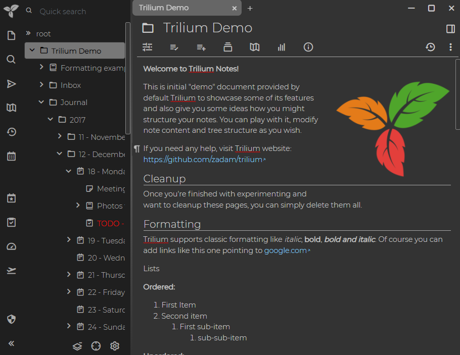
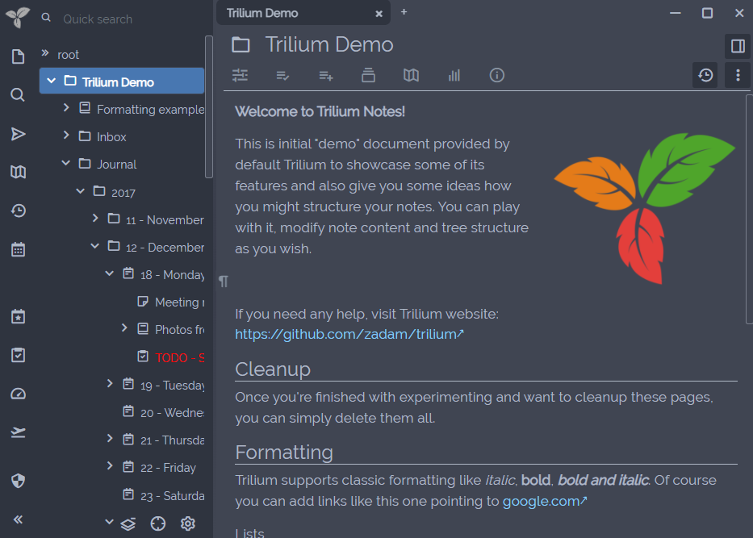
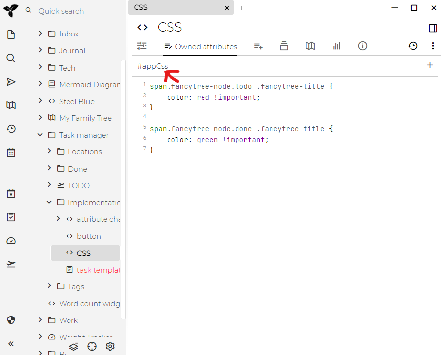

默认情况下，Trilium带有很少的颜色主题，白色是默认主题。要切换为深色主题，您只需转到Options（右上方）->Appearance选项卡并更改主题。

看起来是这样的：



## 自定义CSS主题

Trilium提供了自定义用户主题的概念。您可以通过创建CSS[代码笔记](./代码笔记.md)并使用`appTheme` [标签](./属性.md)对其进行标注来制作自己的主题。

您可以在下面看到一个示例：

```css
@font-face {
  font-family: 'Raleway';
  font-style: normal;
  font-weight: 400;
  src: url('/custom/fonts/raleway.woff2') format('woff2');
}

body.theme-my-theme {
    --main-font-family: 'Raleway' !important;
    --main-font-size: normal;
    --tree-font-family: inherit;
    --tree-font-size: normal;
    --detail-font-family: inherit;
    --detail-font-size: normal;
    --detail-text-font-family: 'Garamond' !important;

    --main-background-color: #404552;
    --main-text-color: #AFB8C6;
    --main-border-color: #AFB8C6;
    --accented-background-color: #383C4A;
    --more-accented-background-color: #2F343F;
    --header-background-color: #383C4A;
    --button-background-color: #2F343F;
    --button-disabled-background-color: #404552;
    --button-border-color: #333;
    --button-text-color: #AFB8C6;
    --button-border-radius: 2px;
    --primary-button-background-color: #6c757d;
    --primary-button-text-color: white;
    --primary-button-border-color: #6c757d;
    --muted-text-color: #86919F;
    --input-text-color: #AFB8C6;
    --input-background-color: #404552;
    --hover-item-text-color: white;
    --hover-item-background-color: #4877B1;
    --active-item-text-color: white;
    --active-item-background-color: #4877B1;
    --menu-text-color: #AFB8C6;
    --menu-background-color: #383C4A;
    --tooltip-background-color: #383C4A;
    --link-color: lightskyblue;
    --modal-background-color: #404552;
    --modal-backdrop-color: black;
    --scrollbar-border-color: rgba(175, 184, 198, 0.5);
}

body.theme-my-theme .note-detail-text {
    font-size: 120%;
}

body.theme-steel-blue .CodeMirror {
    filter: invert(100%) hue-rotate(180deg);
}
```

我们定义一个自定义字体（由[自定义请求处理程序](./自定义请求处理程序.md)提供），然后只需定义一堆CSS变量。这些变量之后在Trilium的CSS样式表中使用。您还可以使用标准CSS选择器进行进一步的自定义（使用开放式开发工具`CTRL-SHIFT-I`来帮助实现此目的），但请记住，HTML结构在将来的版本中可能会发生变化，这可能会破坏你的CSS选择器。因此，最好尽可能限制自己使用CSS变量。

所有CSS选择器都应加上前缀`body.theme-my-theme`以便仅在选择主题时才应用样式表。此类名称是根据笔记的名称自动创建的，例如，"My theme"将转换为`theme-my-theme`（`theme-`是常用前缀）。如果您想手动指定类名，则将其设置为`appTheme`的值（`theme-`前缀也将添加到最终类的前面）。

要激活您的自定义主题，请转到Options -> Appearance。在选择框中，您应该看到所有标签为`appTheme`的笔记（主题）。

如果对主题进行了更改，则应按来重新加载前端，通过按`CTRL-R`以使更改生效。

CSS主题可以导出到.tar存档中，并共享给其他用户。不建议从不受信任的来源中导入CSS主题，因为存档文件中还可能包含可执行[脚本](./脚本.md)，这可能是有害的。

您可以在[演示文档|文档#演示文档](./文档.md)中找到示例用户主题*Steel Blue*：



## 自定义CSS

Trilium还允许您创建不与主题关联的自定义CSS。这在[脚本编写](./脚本.md)的环境中很有用，例如，您可能希望更改树中笔记的颜色（如[任务管理器](./任务管理器.md)中所使用的）。

为此，只需创建一个CSS类型的[代码笔记](./代码笔记.md)，然后将自定义CSS代码放入笔记中并创建"appCss"[标签](./属性.md)即可。当Trilium前端启动时，所有带有"appCss"标签的笔记将添加到Trilium HTML页面的style元素中。

进行更改后，可以按CTRL-R重新加载Trilium前端来使更改生效。



## 样式化笔记树

如果要在树中为某些特定的笔记赋予特殊的样式，可以给它们指定`cssClass` [标签](./属性.md)，然后将其放入代表树中给定笔记的节点中。

还有一种`iconClass`用法，您可以为树中的笔记定义自定义图标-您可以使用[boxicons](https://boxicons.com/)提供的图标（例如`bx bx-home`），也可以定义自己的CSS类。其中一些东西实际上是不同的。因此，您拥有`bx bxs-piano`而不是`bx bx-piano`。在boxicons网站上，打开文件后，您可以查看字体选项卡来查找文件的命名方式。

当用于[模板](./模板.md)时，`iconClass`和`cssClass`特别强大。

您还可以为给定的笔记类型（和mime类型）创建特定的样式。例如，包含PNG图像的文件笔记将在树中具有以下类：`type-image mime-image-png`。

## 用户提供的主题

以下是Trilium用户开发的主题：
* https://github.com/Abourass/TriliumThemes
* https://github.com/ZMonk91/Material-Dark-Trilium
* https://github.com/jaroet/trilium-theme-lightslategray
* https://github.com/raphwriter/trilium-theme-melon
* https://github.com/Engr-AllanG/trilium-themes
* https://github.com/idelem/trilium-theme-velvet
* https://github.com/SADAVA/trilium-notes-theme-dark-plus
* https://github.com/WKSu/trilium-solarized-theme
* https://github.com/en3r0/Trilium-Nord-Theme
* https://github.com/Sebiann/miku-hatsune-trilium-theme
* https://github.com/AllanZyne/trilium-bear-theme
