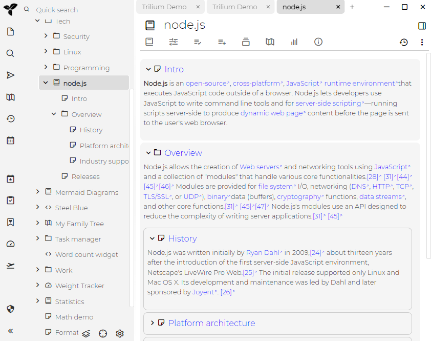
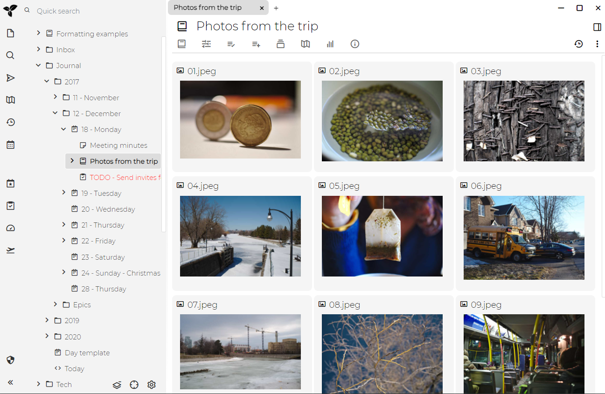

[书笔记](./书笔记.md)是一种笔记类型，以线性方式显示其所有的子节点笔记的内容，所以你可以像阅读一本书一样阅读笔记子树。这对于阅读许多较小的笔记可能很有用。看一个例子可能会更好地解释这个概念：

请注意，在左窗格的树中，"node.js"笔记如何具有一些子项笔记，然后将这些子项显示在右窗格中。

您还可以在 Book 属性中切换到“网格视图”：

~~要放大和缩小，可以使用按钮，也可以将[标签](./属性.md)`bookZoomLevel`的值设置为1到6之间-这表示列数（1表示每个笔记占据右窗格的整个宽度）~~。

请注意，自Trilium 0.36起提供了书籍笔记功能
