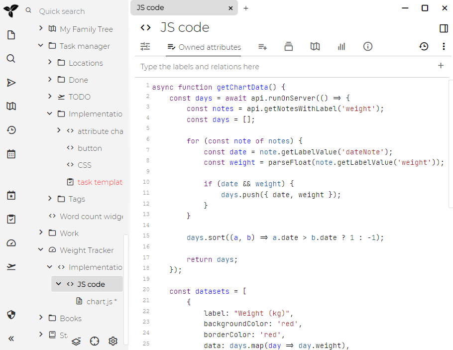
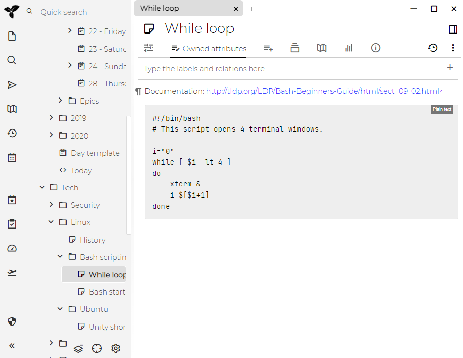

Trilium支持创建"代码"笔记，即包含某种形式化代码的笔记-包括编程语言（C ++，JavaScript），结构化数据（JSON，XML）或其他类型的代码（CSS等）。

这对以下几件事可能很有用：

* 计算机程序员可以将代码段存储为笔记，并高亮显示语法
* 可以在Trilium内部执行JavaScript代码笔记，以实现某些附加功能
    * 我们称这样的JavaScript代码笔记"脚本" -参见[脚本](./脚本.md)
* JSON，XML等可用作结构化数据的存储（通常与脚本结合使用）

## 额外的语言

Trilium支持多种语言的语法高亮显示，但默认情况下仅显示其中一部分（以减少项的数量）。您可以在`Options -> Code notes`中添加其他语言（自Trilium 0.35起可用）。

## 代码块

替代代码笔记的是"代码块"-文本笔记的功能，可以向文本编辑器添加简短的代码片段。缺点是代码块不支持语法高亮显示。

