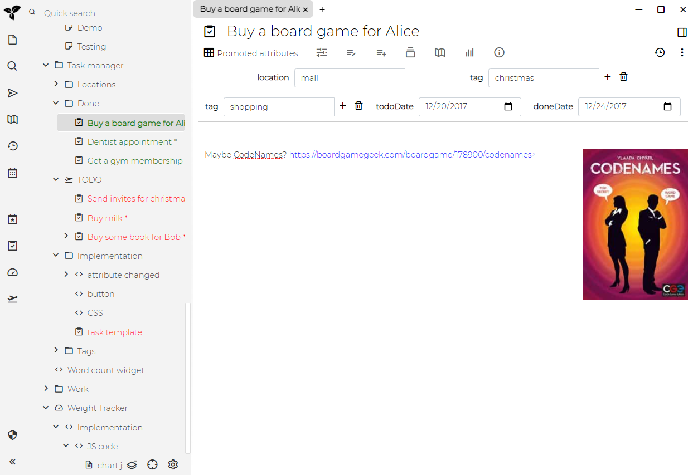

任务管理器是[演示文档](./文档.md#演示文件)中一个[提升属性](./提升属性.md)和[脚本](./脚本.md)的演示用例。

## 演示



任务管理器管理未完成的（TODO）任务和已完成的任务（非空的doneDate属性）。尚未完成的任务将按位置和任意标签进一步分类-每当您更改任务说明中的标签属性时，该任务就会自动移至适当的位置。

任务管理器还与[日志笔记](./日志笔记.md)集成 - 笔记被[克隆](./克隆笔记.md)到todoDate笔记和doneDate笔记的日志中（[前缀)(./树的概念.md#前缀)为"TODO"或"DONE"）。

## 实现

在TODO笔记中创建了新任务，该笔记具有指向任务模板的"child:template"[关系](./属性.md)（请参阅[属性继承](./属性继承.md)）。

### **属性**

任务模板定义了几个[提升属性](./提升属性.md) - todoDate，doneData，标签，位置。重要的是，它还定义了`~runOnAttributeChange`关系-在属性更改时运行的[事件](./事件.md)处理程序。例如，当我们填写doneDate属性时，该[脚本](./脚本.md)会执行-意味着任务已完成，应移至“完成”笔记，并从TODO，位置和标签中删除。

### **“新建任务"按钮**

还有一个"button"笔记，其中包含简单的脚本，该脚本在TODO笔记中添加了一个用于创建新笔记（任务）的按钮。

```javascript
api.addButtonToToolbar({
    title: 'New task',
    icon: 'check',
    shortcut: 'alt+n',
    action: async () => {
        // creating notes is backend (server) responsibility so we need to pass
        // the control there
        const taskNoteId = await api.runOnServer(async () => {
            const todoRootNote = await api.getNoteWithLabel('taskTodoRoot');
            const {note} = await api.createNote(todoRootNote.noteId, 'new task', '');

            return note.noteId;
        });

        // we got an ID of newly created note and we want to immediatelly display it
        await api.activateNewNote(taskNoteId);
    }
});
```

### CSS

在上面的演示截图中，您可能会注意到TODO任务为红色，DONE任务为绿色。

这可以通过以下CSS[代码笔记](./代码笔记.md)来完成，它定义了额外的CSS类：

```CSS
span.fancytree-node.todo .fancytree-title {
    color: red !important;
}

span.fancytree-node.done .fancytree-title {
    color: green !important;
}
```

该[代码笔记](./代码笔记.md)具有`appCss`[标签](./属性.md)，Trilium在启动时会识别该[标签](./属性.md)，并将其作为CSS加载到应用程序中。

此功能的第二部分基于上述事件处理程序，该事件处理程序根据任务状态将`#cssClass`标签分配给"done"或"todo"的任务。