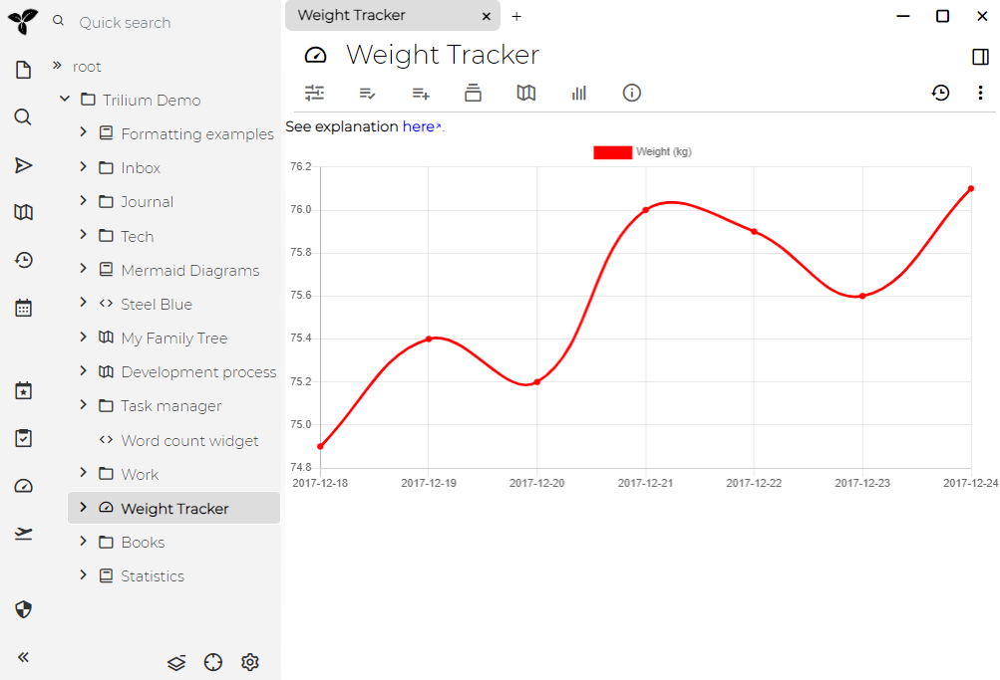

Weight Tracker是[演示文档](./文档.md#演示文件)中提供的[脚本API](./脚本API.md)用例。

[日志笔记](./日志笔记.md)显示（除其他外）我们如何在日志[模板](./模板.md)中设置"weight"[提升属性](./提升属性.md)。然后汇总数据并显示一个很好的重量时间变化图表。

## 演示



## 如何从顶部栏中删除体重跟踪器按钮

在Weight Tracker的链接图中，有一个笔记“Button”。打开它并删除或注释掉它的内容。重启应用程序后，体重追踪器按钮将消失。

## 实现

注意上面的屏幕快照中的"Weight Tracker"类型为"Render HTML note"。这样的笔记本身没有任何有用的内容，它的唯一目的是提供一些[脚本](./脚本.md)可以渲染某些输出的地方。该脚本是根据[关系](./属性.md) 定义的`renderNote` - 恰巧它是Weight Tracker的子`Implementation`。

然后，此实现[代码笔记](./代码笔记.md)包含一些HTML和JavaScript，这些HTML和JavaScript会加载所有具有"weight"属性的笔记并将它们显示在图表中。为了实际渲染图表，我们使用第三方库[chart.js](https://www.chartjs.org/)作为附件导入（它不内置于Trilium中）。

### **JS代码**

想要了解脚本，这里是"JS code" 笔记内容：
```javascript
async function getChartData() {
    const days = await api.runOnServer(async () => {
        const notes = await api.getNotesWithLabel('weight');
        const days = [];

        for (const note of notes) {
            const date = await note.getLabelValue('dateNote');
            const weight = parseFloat(await note.getLabelValue('weight'));

            if (date && weight) {
                days.push({ date, weight });
            }
        }

        days.sort((a, b) => a.date > b.date ? 1 : -1);

        return days;
    });

    const datasets = [
        {
            label: "Weight (kg)",
            backgroundColor: 'red',
            borderColor: 'red',
            data: days.map(day => day.weight),
            fill: false,
            spanGaps: true,
            datalabels: {
                display: false
            }
        }
    ];

    return {
        datasets: datasets,
        labels: days.map(day => day.date)
    };
}

const ctx = $("#canvas")[0].getContext("2d");

new chartjs.Chart(ctx, {
    type: 'line',
    data: await getChartData()
});
```