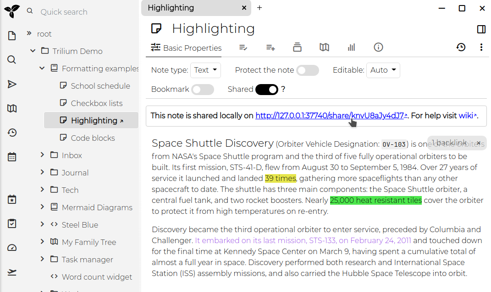
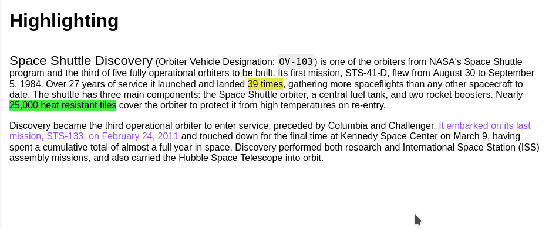
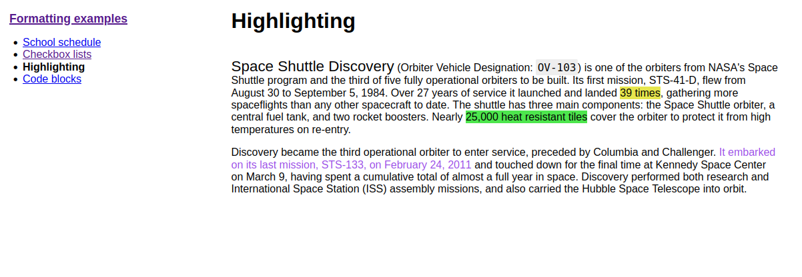
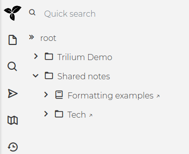

从 v0.49 开始，Trilium 提供了一个功能，可以将选定的笔记共享为可公开访问的只读文档。

此功能的基本先决条件是[安装服务器](./服务器安装.md) - 这是托管笔记的地方。

**共享笔记**
--------

点击“shared”开关，会出现可以点击的 URL。

这是打开的链接：
  

该 URL 指的是 localhost (127.0.0.1)，因为没有配置同步服务器。

**共享笔记子树**
----------

共享便笺实际上共享整个便笺子树，上面显示的便笺只是没有任何子节点。

如果我共享整个“格式化”子树，则页面如下所示：

您可以在右侧看到基本导航。有了这个，您可以创建小型网站。

**高级选项**
--------

### **为共享笔记设置样式**

默认共享页面非常简陋。如果您想更好地设计它，您可以：

*   添加`~shareCss`与将在共享页面中链接的 CSS 代码注释的关系
    *   如果您希望将其应用于整个子树，请不要忘记使标签可继承
    *   链接的 CSS 代码注释也需要在共享子树中。如果要从左侧树导航中隐藏它，`#shareHiddenFromTree`请在 CSS 代码注释中添加标签。
*   如果您进行大量样式更改，则建议`#shareOmitDefaultCss`在共享子树上使用，这样您就不需要覆盖默认样式表（这也将避免将来在默认 CSS 更改时出现问题）。

### **脚本**

`~shareJs`可以使用关系向共享笔记注入 JavaScript 笔记。

如果您想访问例如属性或遍历链接的 JavaScript 注释中的树，您可以使用通过全局[`fetchNote(noteId = current)`函数](https://github.com/zadam/trilium/blob/master/src/public/app/share.js)可用的 API ，例如：

const  currentNote  =  await  fetchNote ( ) ; const  parentNote  =  await  fetchNote ( currentNote.parentNoteIds [ 0 ] ) ; _ _ for  ( const  attr  of  parentNote . attributes )  {    控制台. 日志（属性。类型， 属性。名称， 属性。值）； }

### **创建人类可读的 URL 别名**

共享笔记可以使用类似的 URL 访问`http://domain/share/knvU8aJy4dJ7`，其中最后一部分是笔记的 ID。

您可以添加`#shareAlias`到单个注释以使 URL 更好，例如`#shareAlias=highlighting`将使 URL 看起来像`http://domain/share/highlighting`。

请注意，您有责任保持别名的唯一性。

### **查看所有共享笔记**

所有共享笔记都归类在自动管理的“共享笔记”笔记下。除了查看共享的内容外，您还可以通过将笔记克隆/移动到此笔记来有效地共享/取消共享笔记。

### **网站图标**

`~shareFavicon`您可以通过创建指向包含 favicon（例如`ico`格式）的文件注释的关系来定义用于共享页面的自定义 favicon 。

### **作为根共享笔记**

您可以将`#shareRoot`属性添加到文件夹或笔记中，当您访问[http://domain/share](http://domain/share)时，它将被链接。这可以更容易地将 Trilium 用作一个成熟的网站，因为您可以创建一个笔记来充当“主页”。

**限制**
------

共享笔记功能与标准功能相比非常有限。

**缺少**的不详尽清单是：

*   关系图支持
*   书笔记只显示子笔记列表
*   代码笔记没有突出显示
*   笔记树是静态的

将来可能会删除/减少其中一些限制。