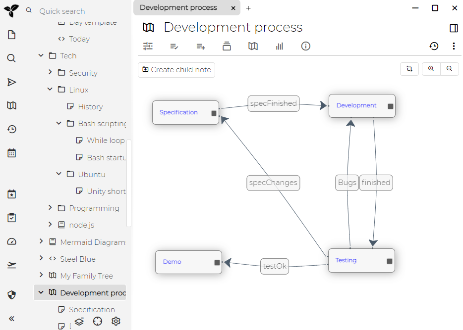

关系映射图是一种将[笔记](./树的概念.md#笔记)及其[关系](./属性.md)可视化的笔记。看一个例子：
## 开发过程演示

这是一个基本示例，您可以使用关系图创建简单的关系映射图：

这是创建它的方法：

我们首先从头创建名为"开发过程"的新笔记，然后将其类型更改为"Relation map"，从头开始。之后，我们一个接一个地创建新笔记，然后单击将其放置。我们还可以拖动笔记之间的[关系](./属性.md)并命名它们。就这样！

map上的项-"Specification"，"Development"，"Testing" 和"Demo"实际上是在"开发过程"笔记下创建的笔记-您可以单击它们并写一些内容。笔记之间的连接称为[关系](./属性.md)。

## 家庭关系演示

这是使用一些高级概念的更复杂的演示。结果图在这里：

这是您的方法：

这里有几个步骤：

* 我们从空关系映射图和代表Prince Philip和Queen Elizabeth II的两个现有笔记开始。这两个笔记已经定义了" isPartnerOf"[关系](./属性.md)。
    * 实际上有两种"逆"关系（一种是从菲利普到伊丽莎白，另一种是从伊丽莎白到菲利普）
* 我们将两个笔记都拖动到关系映射图，然后放置到合适的位置。注意如何显示现有的"isPartnerOf"关系。
* 现在我们创建新笔记-我们将其命名为"Prince Charles"，然后通过单击所需位置将其放置在关系图上。默认情况下，笔记是在关系图笔记下创建的（在左侧的笔记树中可见）。
* 我们针对Philip和Elizabeth创建了两个新的关系"isChildOf"
    * 现在出现了一些意外情况-我们还可以看到该关系以显示另一个"hasChild"关系。这是因为存在一个[关系定义](./提升属性.md)，该[关系定义](./提升属性.md)将"isChildOf"作为"hasChildOf"的"[逆)(./提升属性.md#逆关系)"关系（反之亦然），因此将自动创建它。
* 我们为Princess Diana创建了另一个笔记，并从Charles创建了"isPartnerOf"关系。再次注意关系如何同时具有双向箭头-这是因为"isPartnerOf"定义再次将其逆关系指定为"isPartnerOf"，因此将自动创建相反的关系。
* 最后一步，我们可以平移和缩放地图以使其更适合窗口尺寸。

上面提到的关系定义来自"Person template"笔记，该笔记分配给"My Family Tree"关系笔记的任何子项。您可以在[演示文档](./文档.md#演示文件)中进行整个操作。

## See also

* [笔记映射图](./笔记映射图.md)与关系映射图的概念相似