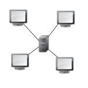
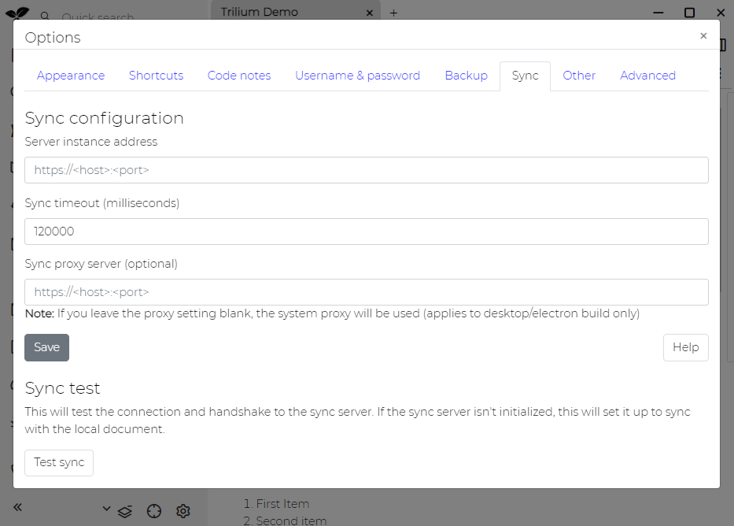
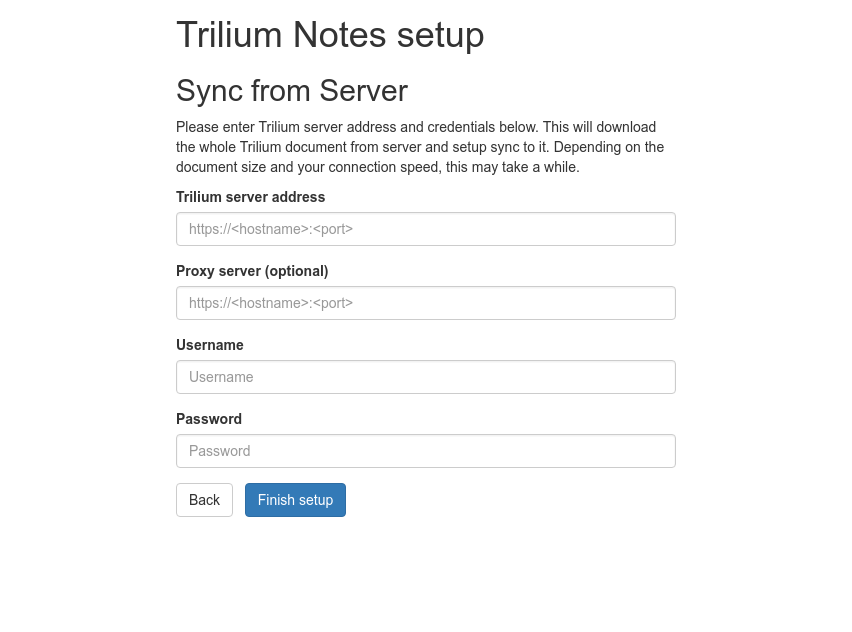
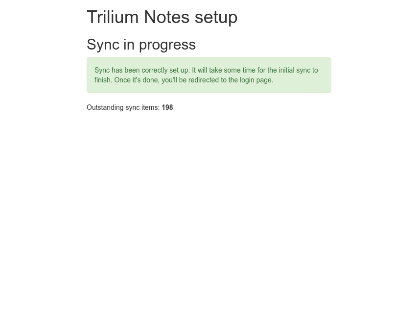

Trilium是离线优先笔记应用程序-使用桌面应用程序时，所有数据都存储在本地，但是您还可以选择设置与服务器实例的同步。当添加另一个桌面客户端时，您可以进入星形拓扑：

这意味着有一个中央服务器（我们将其称为_同步服务器_）和多个_客户端_（有时称为_桌面_）实例，它们均指向该同步服务器并与其同步。

设置好同步后，同步将自动持续进行-您无需手动触发。它就应该“正常工作”。

**如何设置同步**
----------

### **设置从桌面实例到同步服务器的同步**

当您已经拥有Trilium的桌面实例并且想要[在Web主机上设置同步服务器)(./服务器安装.md))时，可以使用这种方法。

因此，假设您的服务器实例已经部署，但是尚未初始化（没有数据）。然后打开您的桌面实例，单击Options -> Sync tab -> Sync configuration，并将"Server instance address"设置为指向您的同步服务器。单击Save。

现在单击"Test sync"按钮，它将告诉您与同步服务器的握手是否成功。如果是，则与同步服务器启动同步-客户端开始将所有数据推向服务器实例。这可能需要一些时间才能完成，但是您可以关闭"Options"对话框并继续使用Trilium。

您还可以定期检查服务器实例，以查看同步是否完成。完成后，您应该会看到登录屏幕。

### **从同步服务器执行安装程序同步执行桌面实例**

当您已经有同步服务器并且想要设置桌面实例以与其进行同步时，将使用此方法。

在这里，我们假设您下载了平台的[最新版本](https://github.com/zadam/trilium/releases/latest)，并将其解压缩并运行。

由于桌面实例完全是空的，它将首先询问您是要创建初始文档还是要设置与同步服务器的同步-您需要选择第二个选项。

您将需要配置Trilium服务器地址，并且重要的是还要正确的用户名/密码（同步设置需要身份验证）。

点击"Finish setup"按钮，如果一切顺利，您将看到以下界面：

同步完成后，您将自动重定向到Trilium应用程序。

**代理设置**
--------

支持两种不同的设置：

*   您可以在"Options / Sync"中显式设置要使用的代理服务器。当前仅支持未经身份验证的代理服务器。
*   如果未明确配置代理服务器，则Trilium将使用系统代理设置

**证书问题**
--------

使用 TLS 时，Trilium 客户端将尝试验证服务器证书。在某些情况下（自签名证书、某些公司代理服务器），验证将不成功，同步将失败。在这些情况下，您可以运行 Trilium 客户端并将环境变量`NODE_TLS_REJECT_UNAUTHORIZED`设置为`0`：

    export NODE_TLS_REJECT_UNAUTHORIZED=0

TLS 证书不会被验证，只是按原样接受。

较新的 Trilium 版本中的脚本为`trilium-no-cert-check.sh`。

**冲突解决**
--------

有时您会遇到这样的情况：在同步笔记更改之前，您需要在多个实例中编辑同一笔记。

Trilium通过仅接收较新的更改并丢弃较旧的更改来处理这种情况。较早的更改在[笔记修订](./笔记修订.md)仍然应该可见，因此可以恢复在解决冲突中丢失的所有数据。

**哈希检查**
--------

每次完成同步后，Trilium都会计算客户端和同步服务器上所有同步数据的哈希值。如果存在差异，则说明出现问题，Trilium将运行自动恢复机制。