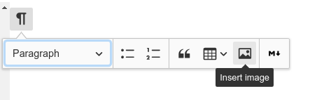

Trilium 支持存储和显示图像。支持的格式为 JPEG、PNG 和 GIF。

图像实际上是放置在笔记树中的[笔记类型)(./树的概念.md)。它的参考可以复制到文本注释中，因此它显示在文本本身中。

**上传图片**
--------

要将图像添加到笔记中，只需将其从文件资源管理器拖到 Trilium 内的笔记编辑器中，图像就会被上传。

或者，您可以单击块工具栏，然后单击“插入图像”：

您还可以从网络复制和粘贴图像 - 图像将（异步）下载和嵌入。

**压缩**
------

由于 Trilium 并不是真正的图像数据的主要存储，它会在将上传的图像存储到数据库之前尝试压缩和调整大小（使用非常激进的设置）。然后您可能会注意到一些质量下降。基本质量设置在Options -> Other中可用。

如果您想以**原始分辨率**保存图像，建议将它们保存为笔记的附件（右上角“Note actions -> Upload file”）。