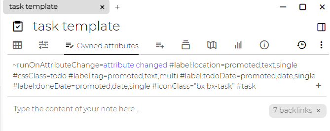

笔记属性是给定笔记所拥有（分配）的键值记录。

属性有两种类型：

*   标签-简单的键值文本记录
*   关系-指定到另一个笔记的命名关系（链接）

有时我们在谈论标签和关系-请记住，它们都是属性的类型。

**标签**
------

标签可用于多种用途：

*   作为具有可选值的标签 - 例如，在对书籍进行编目时，您可以添加诸如 #year=1999、#genre="sci-fi"、#author="Neal Stephenson" 之类的标签
*   属性可用于配置一些高级功能/设置 - 见下文
*   插件/脚本可以使用这些来标记带有一些特殊值/元数据的笔记（例如，基于可以创建图表的[日志笔记](./日志笔记.md)，[体重追踪器](./体重追踪器.md)将具有“重量”属性）。

标签可用于[搜索](./搜索.md)。

### **标准标签**

以下标签用于高级配置：

*   `disableVersioning`-禁用自动版本化。对于大型但不重要的笔记很有用-例如用于脚本编写的大型JS库
*   `calendarRoot`-标记用作[日志笔记](./日志笔记.md)的根的笔记。只能有一个有这样标记的笔记。
*   `archived`-具有此标签的注释在基于自动完成的搜索中将不可见（跳转，添加链接）。也适用于其所有子节点。
*   `excludeFromExport` -笔记（及其子树）不会包含在任何笔记导出中
*   `run`-定义脚本应在哪些事件上运行。可能的值为：
    *   `frontendStartup` -Trilium前端启动（或刷新）时。
    *   `backendStartup` -Trilium后端启动时
    *   `hourly` -每小时运行一次
    *   `daily` -每天运行一次
*   `disableInclusion` -具有此标签的脚本不会包含在父脚本执行中。
*   `sorted` -使子笔记按标题按字母顺序排序。请参阅[排序](./排序.md)。
*   `hidePromotedAttributes`
*   `readOnly`-编辑器处于只读模式。仅适用于文本笔记。[在这里](https://github.com/zadam/trilium/issues/371)查看一些用例。
*   `autoReadOnlyDisabled`- 文本/代码笔记太大时可以自动设置为只读模式。您可以通过将此标签添加到笔记来禁用此行为
*   `cssClass`- 然后将此标签的值作为 CSS 类添加到表示树中给定笔记的节点。这对于高级[主题](./主题.md)很有用。可以在`template`笔记中使用。
*   `iconClass`- 此标签的值作为 CSS 类添加到树上的图标中，有助于在视觉上区分树中的笔记。一个例子：`bx bx-home`- 图标取自[boxicons](https://boxicons.com/)。可用于[模板](./模板.md)笔记。
*   `customRequestHandler`和`customResourceProvider`- 请参阅[自定义请求处理程序](./自定义请求处理程序.md)
*   `widget`- 见[自定义小部件](./自定义小部件.md)
*   `workspace`, `workspaceIconClass`, `workspaceTabBackgroundColor`- 见[工作区](https://github.com/zadam/trilium/wiki/Workspace)
*   `searchHome`- 新的搜索笔记将作为该笔记的子项创建（否则它们将在[日志笔记](./日志笔记.md)中创建）
*   `hoistedSearchHome`- 当提升到该笔记的某个祖先时，将创建新的搜索笔记作为该笔记的子项
*   `inbox`- 新笔记的默认inbox位置
*   `hoistedInbox`- 当挂起到此笔记的某个祖先节点时，新笔记的默认inbox位置
*   `sqlConsoleHome`- SQL 控制台笔记的默认位置
*   `bookmarked`和`bookmarkFolder`- 见[书签](./书签.md)
*   `shareXXX`[共享](./共享.md)中描述的标签
*   `keyboardShortcut`可以定义为例如“Ctrl+I”。按下此键盘组合将带您进入定义它的笔记。请注意，必须重新加载/重新启动 Trilium (Ctrl+R) 才能使更改生效。

**关系**
------

关系是两个笔记之间的一种链接。

例如，在保留书籍数据库时，可以使用此关系，可以通过在书本上定义指向作者笔记的"author"关系，来使用关系来保持书（本笔记）与该书的作者（笔记）之间的正式链接。

关系还用于一些高级脚本编写，例如将脚本附加到某些笔记上发生的事件。

### **标准关系**

[事件](./事件.md)：

*   `runOnNoteCreation` -在后端创建笔记时执行
*   `runOnNoteTitleChange` -在笔记标题更改时执行（还包括笔记创建）
*   `runOnNoteChange` -更改笔记时执行（还包括笔记创建）
*   `runOnChildNoteCreation` -在_此_笔记下创建新笔记时执行
*   `runOnAttributeCreation`-在_此_笔记下创建新属性时执行
*   `runOnAttributeChange`-在_此_笔记下更改属性时执行

其他关系：

*   `template`-即使没有父子关系，附加笔记的属性也会被继承。有关详情，请参见[模板](https://github.com/zadam/trilium/wiki/Template)。
*   `renderNote` -类型为"render HTML note"的笔记将使用代码笔记（HTML或脚本）进行渲染，并且需要使用此关系指向应渲染的笔记
*   `widget` -此关系的目标将被执行，并在侧边栏中显示为小部件
*   `shareXXX` [共享](https://github.com/zadam/trilium/wiki/Sharing)中描述的标签

**多重性**
-------

属性允许多重性-可以有多个具有相同名称的属性。然后，我们将此类属性称为"多值属性"。

**属性定义/提升的属性**
--------------

特殊类型的标签用于创建“标签/属性”定义。有关详细信息，请参阅 [提升属性](./提升属性.md)。

**属性继承**
--------

请参阅[属性继承](./属性继承.md)。