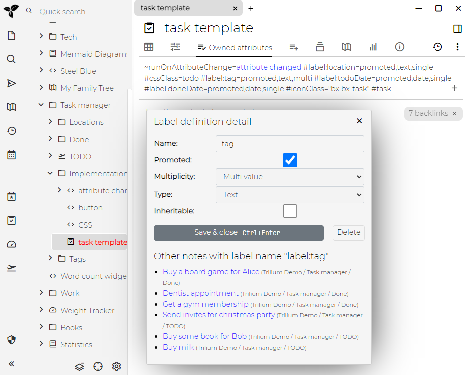

提升属性是被认为很重要的[属性](./属性.md)，因此被"promoted"到主笔记的UI中。请参见下面的示例：

您可以看到笔记具有几种字段的形式。这些都只是常规属性，唯一的区别是它们出现在笔记本身上。

属性非常有用，因为它们允许查询和脚本自动化等。但是，它们也很不方便地隐藏在笔记属性对话框中。这样，您就可以选择几个重要的条目，并将其推到用户的最前面。

现在，我们如何使属性出现在UI上？

## 属性定义

属性始终是名称-值对，其中名称和值都是字符串。

*属性定义*指定应如何解释此值-它只是字符串还是日期？我们应该允许多个值或者笔记？重要的是，我们是否应该*提升*该属性？

在上图中，您可以看到两个标签-具有一些值的tag和todoDate。但是在它们下面，您会再次注意到tag和todoDate属性，但是现在是"Label definition"类型。这些"definition"属性定义"value"属性的行为。

因此，值有一个属性，而定义有一个属性。但是请注意，"definition"属性如何是[可继承的)(./属性继承.md)，这意味着它也适用于所有子代笔记。因此，以某种方式，此定义用于整个子树，而"value"属性仅应用于此笔记。

### 逆关系

有些关系总是成对出现-我最喜欢的例子是家庭。如果您有代表丈夫的笔记和代表妻子的笔记，则这两个之间可能存在关系`isPartnerOf`。这是双向关系，也就是说，如果某个关系是从丈夫到妻子指向的，那么应该总是存在另一个从妻子到丈夫指向的关系。

另一个例子是与父母-孩子的关系。同样，它们总是成对出现，但是在这种情况下，它不是完全相同的关系-从父级到子级的关系可能会调用`isParentOf`，而另一个从子级到父级的关系会调用`isChildOf`。

关系定义允许您指定这样的"逆关系"-对于刚刚定义的关系，您可以指定哪个是逆关系。需要注意的是在第二个例子中，我们应该有两个关联定义-一个用于定义`isParentOf`，它定义`isChildOf`为逆关系，而第二个关系定义`isChildOf`，它定义`isParentOf`为逆关系。

这在内部的作用是，每当保存定义了逆关系的关系时，我们都要检查该逆关系是否存在于关系目标笔记上。同样，当我们删除关系时，我们也会删除目标笔记上的逆关系。