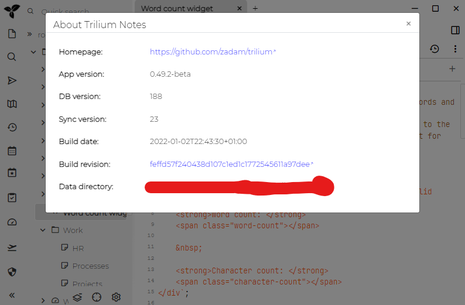

数据目录包含：

* `document.db` - [文档](./文档.md)
* `config.ini` - 实例设置文件，例如运行Trilium应用程序的端口
* `backup` - 包含自动的文件[备份](./备份.md)
* `log` - 包含应用程序日志文件

## 位置

查找Trilium使用哪个数据目录的简单方法是查看"About Trilium Notes"对话框（位于左上角的"Menu"中）：



确定位置的方法如下：

数据目录通常是命名的`trilium-data`，它存储在：

* `/home/[user]/.local/share`  对于Linux
* `C:\Users\[user]\AppData\Roaming` 适用于Windows Vista及更高版本
* `/Users/[user]/Library/Application Support` 对于Mac OS
* 如果上面的某些路径不存在，则用户的home是一个后备路径
* 用户的home也是[docker)(./Docker安装服务器.md)的默认设置

如果要备份Trilium数据，只需备份该文件-它包含您需要的所有内容。

### 更改数据目录的位置

如果要使用默认目录以外的其他位置用于数据目录，则可以通过TRILIUM_DATA_DIR环境变量将其更改为其他位置：

#### Linux

```
export TRILIUM_DATA_DIR=/home/myuser/data/my-trilium-data
```

#### Mac OS X

您需要在`~/Library/LaunchAgents`下面创建一个`.plist`文件，以便在每次登录时正确加载该文件。

要手动加载，您需要使用 `launchctl setenv TRILIUM_DATA_DIR <yourpath>`

这是一个预定义的模板，您只需要在其中添加路径即可：

```xml
<?xml version="1.0" encoding="UTF-8" standalone="yes"?>
<!DOCTYPE plist PUBLIC "-//Apple//DTD PLIST 1.0//EN" "http://www.apple.com/DTDs/PropertyList-1.0.dtd">

<plist version="1.0">
    <dict>
        <key>Label</key>
        <string>set.trilium.env</string>
        <key>RunAtLoad</key>
        <true/>
        <key>ProgramArguments</key>
        <array>
            <string>launchctl</string>
            <string>setenv</string>
            <string>TRILIUM_DATA_DIR</string>
            <string>/Users/YourUserName/Library/Application Support/trilium-data</string>
        </array>
    </dict>
</plist>
```

### 创建脚本以与特定数据目录一起运行

全局设置环境变量的替代方法是仅使用此环境变量运行Trilium Notes。这允许使用不同的安装方式比如两个[文档](./文档.md)实例或"便携式"安装。

要在基于Unix的系统中做到这一点，只需如下所示运行trilium：

```
TRILIUM_DATA_DIR=/home/myuser/data/my-trilium-data trilium
```

为了方便起见，您可以将上述命令另存为shell脚本。
