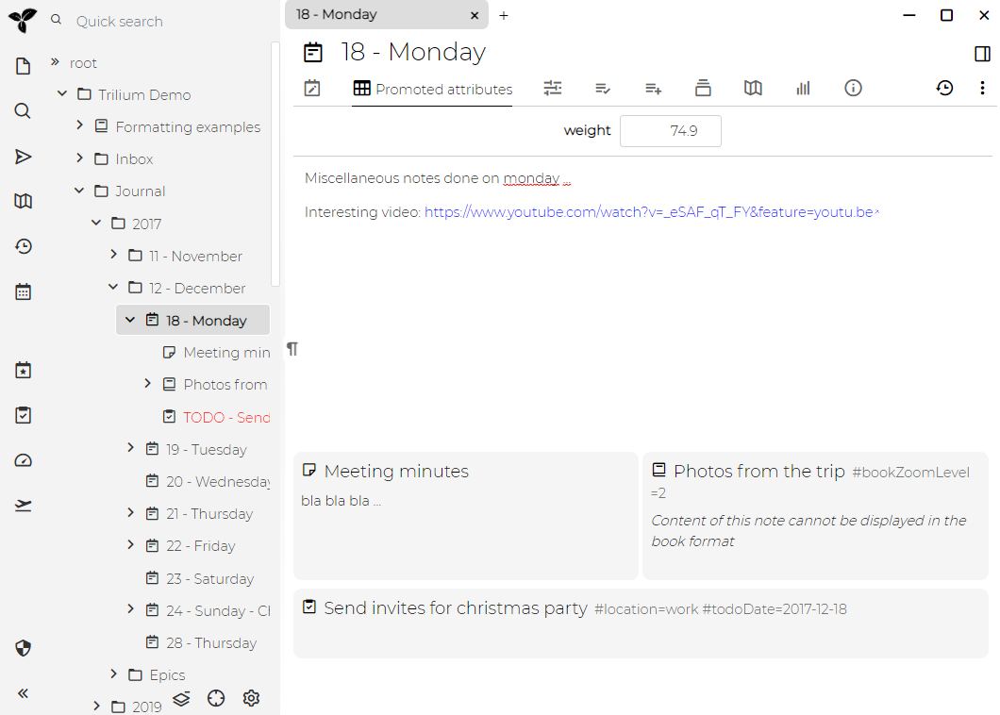

记笔记的一种常见方式是许多笔记将集中在某个日期附近-例如，您有某些任务需要在某个日期完成，您需要在特定日期开会，您有自己的想法等等。他们都围绕各自发生的日期。因此，创建某些"每日工作区"是有意义的，该工作区将集中与特定日期相关的所有笔记。

为此，Trilium提供了"日志笔记"的概念。Trilium每天半自动生成一个笔记。在此笔记下，您可以保存所有这些相关笔记。

选择一个现有的日期笔记，菜单栏包含一个日历小部件。选择任何一天为该天创建一个笔记。

这种模式也因为[克隆)(./克隆笔记.md)功能而运作良好 - 笔记可以出现在笔记树中的多个位置，因此除了出现在日笔记下，它还可以分类到其他笔记中。

**演示**
------

您可以看到在"Journal"笔记下日志笔记的结构 - 有一个2017年的笔记，在其下有"12 - December"，然后包含"18 - Monday"。这是我们的"日志笔记"，其中包含一些内容，还包含一些子笔记（其中一些来自[任务管理器](./任务管理器.md)）。

您还可以注意到该日志如何拥有[提升属性](./提升属性.md)"weight"，您可以在其中跟踪每日体重。然后，此数据将在[体重追踪器](./体重追踪器.md)中使用。

**模板**
------

Trilium提供了[模板](./模板.md)功能，可以与日志笔记一起使用。

您可以在Journal的根目录上定义以下关系之一（由`#calendarRoot`标签标识）：

*   yearTemplate
*   monthTemplate
*   dateTemplate

所有这些都是关系。当Trilium为年，月或日期创建新笔记时，它将查看根目录并将相应的`~template`关系附加到新创建的角色。使用此功能，您可以创建您的日志笔记模板，例如日常活动的复选框等。

**日期模式**
--------

`#datePattern`可以通过在根日历笔记（由`#calendarRoot`标签标识）上定义标签来自定义生成的日期笔记的标题。以下是可能的值：

*   `{dayInMonthPadded} - {weekDay}`日笔记被命名为例如“24 - Monday”
*   `{dayInMonthPadded}: {weekDay3}`日笔记被命名为例如“24：Mon”
*   `{dayInMonthPadded}: {weekDay2}`日笔记被命名为例如“24：Mo”
*   `{isoDate} - {weekDay}`日间笔记被命名为例如“2020-12-24 - Monday”

**实现**
------

Trilium 以[后端脚本 API](https://zadam.github.io/trilium/backend_api/BackendScriptApi.html)的形式对日志笔记提供了一些特殊支持- 参见例如 getDateNote() 函数。

使用标签创建日（和年、月）笔记 - 例如`#dateNote="2018-08-16"`，其他脚本可以使用它来向日志笔记等添加新笔记。

Journal 还具有关系`child:child:child:template=Day template`（请参阅[属性继承](./属性继承.md)），它有效地将[模板](./模板.md)添加到日志笔记（Journal 的 Grand-grand-grand 子节点）。