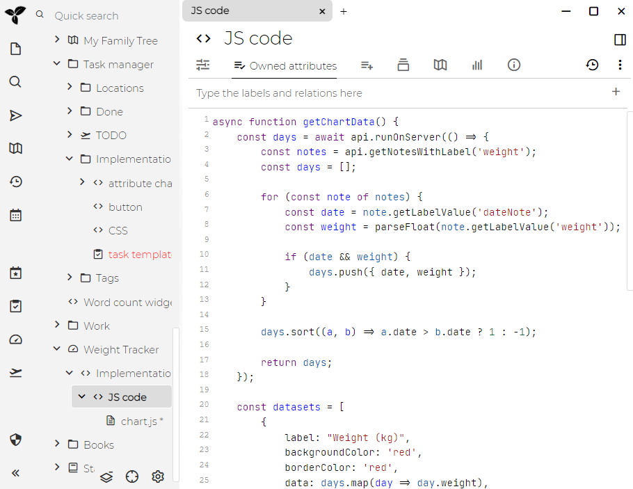
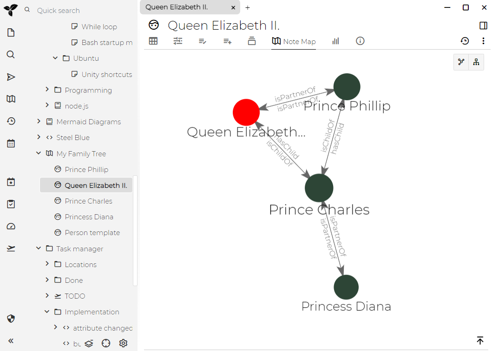
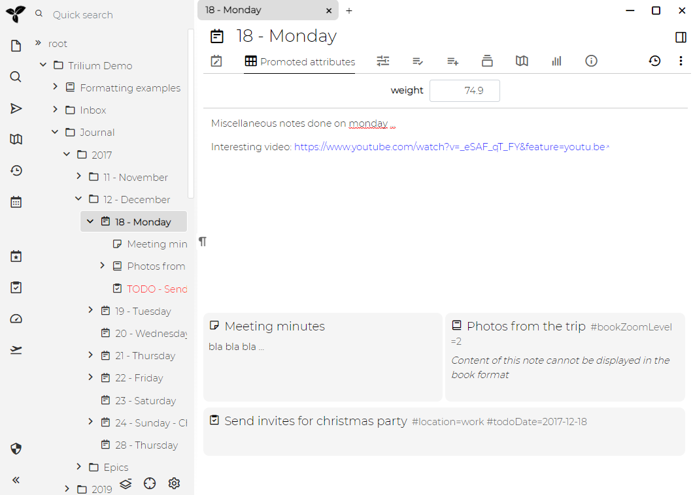
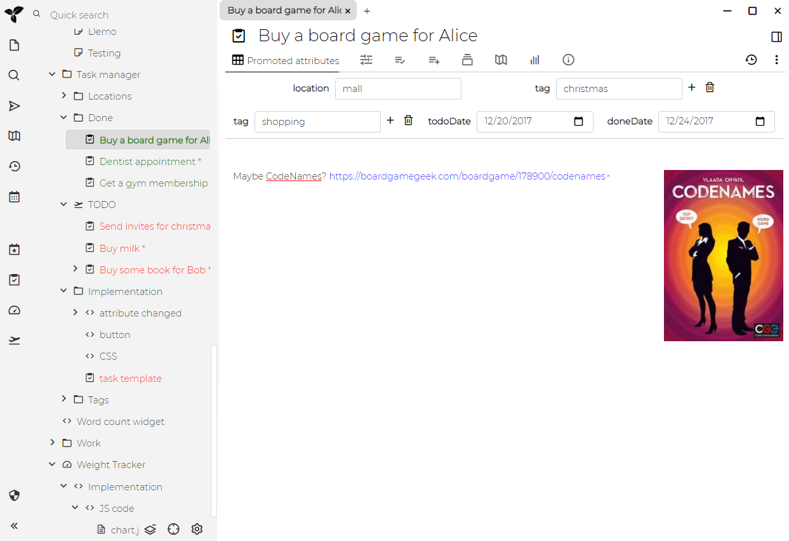
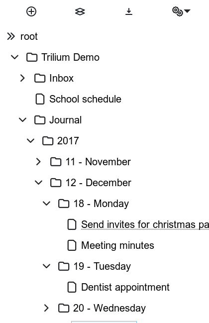

有时，评估软件的最快方法就是通过屏幕截图，下面是一些功能演示：

See [主题](./主题.md.md).

This shows [代码笔记](./代码笔记.md) editor.

See [提升属性](./提升属性.md).

See [关系映射图](./关系映射图.md).

See [笔记映射图](./笔记映射图.md).

See [日志笔记](./日志笔记.md).

See [体重追踪器](./体重追踪器.md).

See [任务管理器](./任务管理器.md).

See [笔记修订](./笔记修订.md).

See [手机](./移动前端.md#手机).

See [平板](./移动前端.md#平板).
