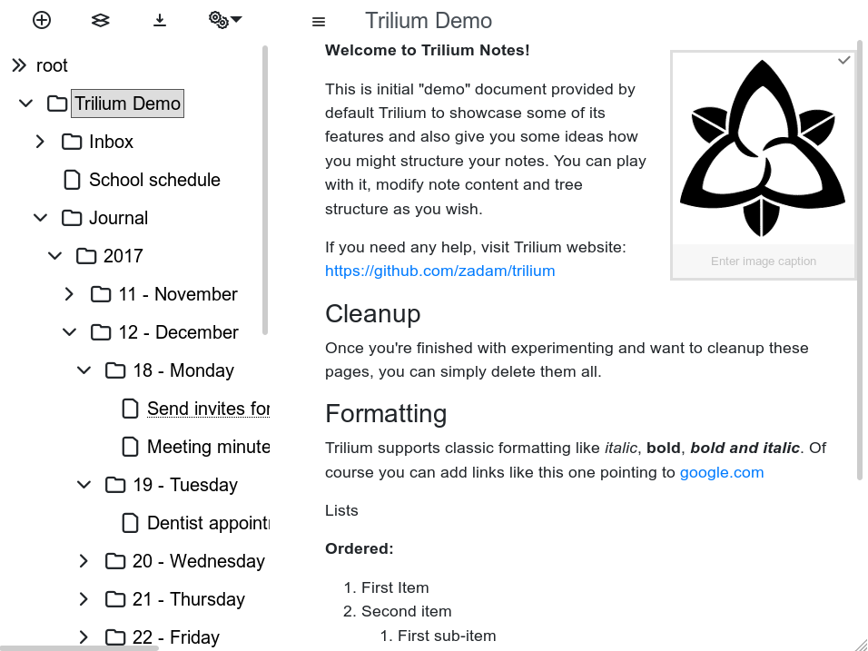

Trilium（[服务器版)(./服务器安装.md)）具有一个移动Web前端，该前端针对基于触摸的设备（智能手机和平板电脑）进行了优化。它会在登录过程中基于浏览器检测自动激活。

与完整的桌面前端相比，移动前端的功能受到限制。有关更多详细信息，请参见下文。

请注意，这不是Android / iOS应用，这只是[服务器版)(./服务器安装.md)上提供的移动友好的网页。

## 屏幕截图

### 手机

### 平板

## 局限性

移动前端仅提供完整桌面前端的某些功能：

*   可以浏览整个笔记树，阅读和编​​辑所有类型的笔记，但是您只能创建文本笔记
*   可以阅读和编辑[受保护的笔记](./受保护的笔记.md)，但不支持创建隐私笔记
*   不支持编辑选项
*   不支持克隆笔记
*   不支持上传文件附件

## 强制使用移动/桌面前端

Trilium自动决定是使用移动前端还是桌面前端。如果不合适，则可以在**登录**页面上使用`?mobile`或`?desktop`查询参数（即，可能需要注销）。

## 脚本

您可以像普通前端一样使用[脚本](./脚本.md)更改行为。对于要执行的脚本，它们需要有标签`#run=mobileStartup`。