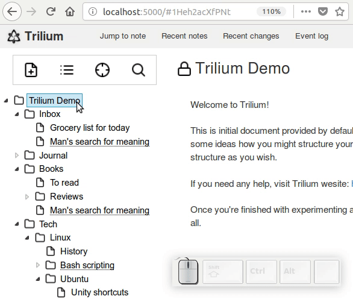
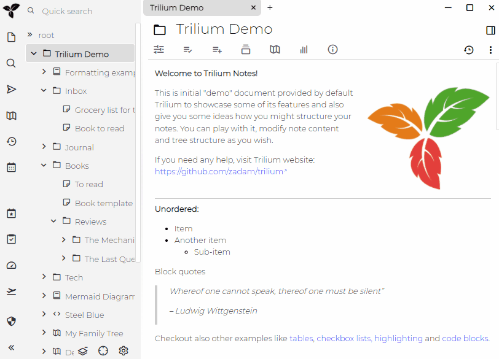
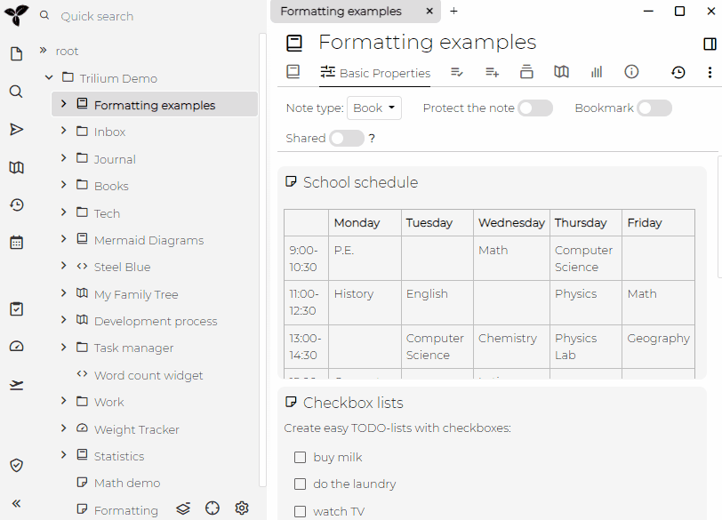

Trilium的目标之一是在之间笔记提供快速舒适的导航。

## 后退和前进

您可以使用alt-left和alt-right在浏览页面的历史记录中前后移动。

这与浏览器的后退/前进功能相同，实际上是为此使用内置的浏览器支持。

当然，这是基本功能和预期功能，但是值得一提的是Trilium在这里可以很好地发挥作用。

## 跳转到笔记

这对于快速查找和查看任意笔记非常有用，请单击顶部的`Jump to`按钮或按`CTRL-J`。然后输入笔记名称的一部分，自动完成功能将帮助您选择所需的笔记。

## 最近的笔记

跳转到笔记还可以显示最近查看/编辑的笔记列表并快速跳转到该列表。

要访问此功能，请单击顶部的`Jump to`按钮。默认情况下（当自动完成不输入任何内容时），此对话框将显示最近备忘的列表。

或者，您可以单击右侧的"time"图标。

==============================

One of the Trilium's goals is to provide fast and comfortable navigation between notes.

## Backwards and forward

You can use alt-left and alt-right to move back and forward in history of viewed pages.

This works identically to browser backwards / forwards, it's actually using built-in browser support for this.

Of course this is basic and expected functionality, but it's worth mentioning that Trilium plays nicely here.

## Jump to note

This is useful to quickly find and view arbitrary note - click on `Jump to` button on the top or press `CTRL-J`.
Then type part of the note name and autocomplete will help you pick the desired note.

### Recent notes

Jump to note also has the ability to show the list of recently viewed / edited notes and quickly jump to it.

To access this functionality, click on `Jump to` button on the top. By default (when nothing is entered into autocomplete), this dialog will show the list of recent notes.

Alternatively you can click on the "time" icon on the right.

