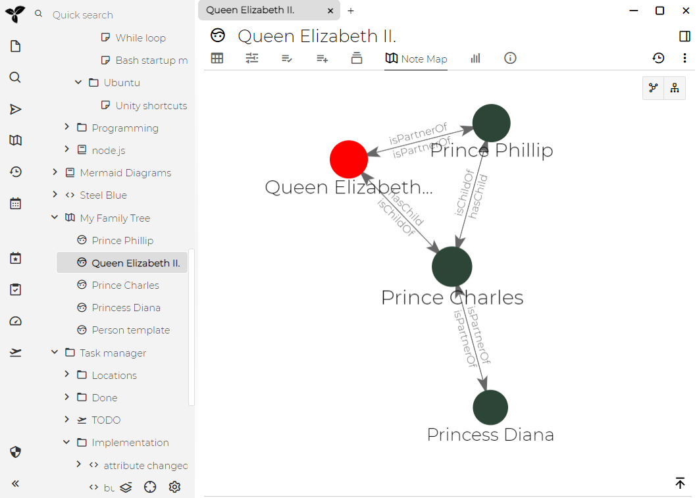
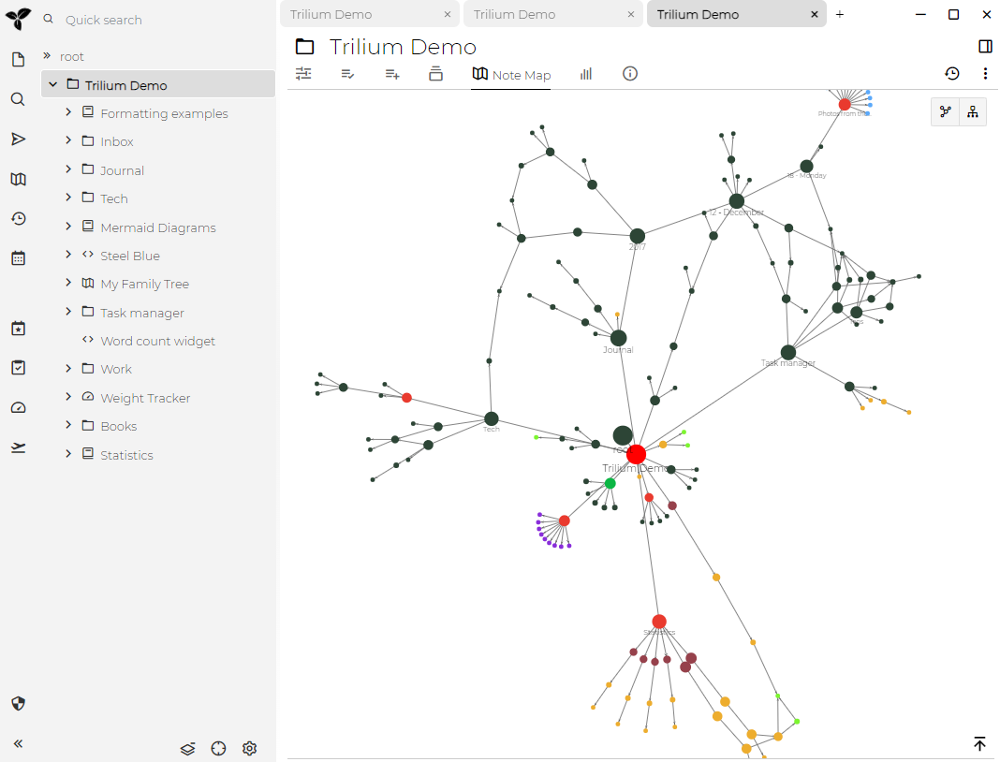

笔记映射图是笔记之间联系的可视化。

这提供了对笔记结构（“网络”）的检查。

有两种类型的笔记映射图：

**链接图**
-------

显示笔记之间的[关系)(./属性.md)：

**树图**
------

显示笔记之间的层次图：

See also
--------

[关系映射图](./关系映射图.md)是一个类似的概念，但有一些区别：

*   笔记映射图是自动生成的，而关系映射图必须手动创建
*   关系映射图是一种笔记，而笔记映射图只是虚拟可视化