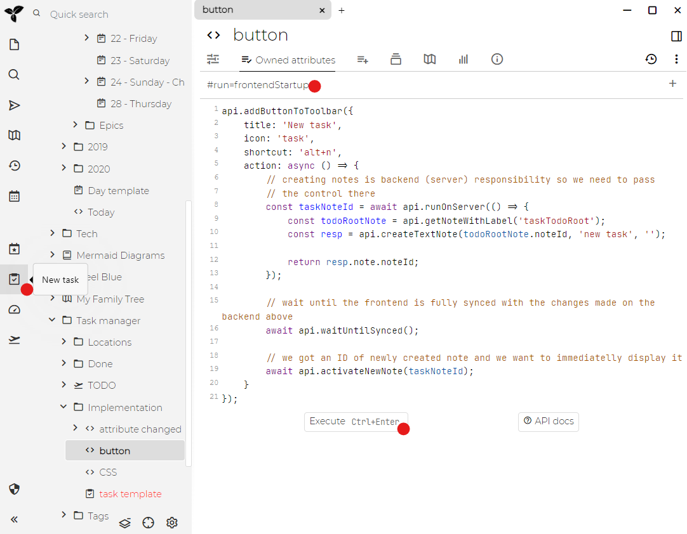

Trilium支持创建[代码笔记](./代码笔记.md)，即允许您存储一些编程代码并将其高亮显示的笔记。特殊情况是JavaScript代码笔记，这些笔记也可以在Trilium内部执行，可以与[脚本API](./脚本API.md)结合使用以提供额外的功能。

## 脚本编写

为了进一步讲解，我必须解释Trilium的基本体系结构 - 本质上，它是一个经典的Web应用程序 - 它具有以下两个主要组件：

* 在浏览器中运行的前端（使用HTML，CSS，JavaScript）- 主要用于与用户进行交互，显示笔记等。
* 后端在node.js runtime中运行JavaScript代码 - 负责例如存储笔记，对其进行加密等。

因此，我们有前端和后端，每个前端和后端都有各自的职责，但是它们的共同特征是它们都运行JavaScript代码。事实是，我们能够创建JavaScript[代码笔记](./代码笔记.md)，并且已经投入使用。

## 按钮用例

让我们看一下演示脚本（默认Trilium[文档](./文档.md)附带）-任务管理器(Task manager)。该脚本要做的一件事就是在Trilium界面上添加一个按钮，使用户可以轻松添加新Task（TODO项）。

首先查看顶部的红色圆圈 - 这是我们想要实现的 - UI中的新按钮，它将创建代表 任务/待办事项 的新笔记。

下方的第一个红点表示我们为此脚本创建的笔记类型-它是"JavaScript fronted"。这是前端，因为向UI添加按钮显然是前端的责任。

在笔记内容中，您可以看到调用API方法之一的代码，该代码专门用于添加新按钮。代码需要设置一些按钮属性：

* 按钮标题
* 应显示在按钮上的图标
* 可选的快捷方式，您可以在该快捷方式下触发按钮
* 最重要的是"操作"-单击按钮时必须执行某些操作

### 动作处理程序

将笔记保存到数据库是后端的责任，因此我们立即将控制权交给后端，并要求其创建笔记。完成此操作后，我们将显示新创建的笔记，以便用户可以设置任务标题以及某些属性。

### 脚本执行

因此，我们有一个脚本会将按钮添加到工具栏。但是我们如何执行它呢？一种可能性是单击"play"图标（用红色圆圈标记的那个）。问题在于，UI更改受Trilium runtime限制，因此当我们重新启动Trilium时，按钮将不存在。

每当Trilium启动时，我们都需要执行它，但是我们可能不想每次启动时都手动单击播放按钮。

解决方案在底部用红色圆圈标记-此笔记的[标签)(./属性.md)为`#run=frontendStartup` - 这是Trilium可以理解的"系统"标签之一。如你所想，一旦Trilium前端启动，这将导致所有带有这种标签的脚本笔记都被执行。

（`#run=frontendStartup`不适用于[移动端)(./移动前端.md)- 如果您想在那里运行脚本，请提供脚本`#run=mobileStartup`标签）

### 更多用例

您可以在[高级用例](./高级用例.md)查看带有说明的更多脚本

## 事件

请参阅[事件](./事件.md)。

## 脚本API

请参阅[脚本API](./脚本API.md)。