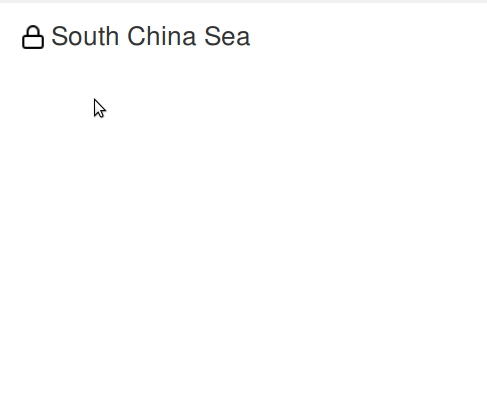
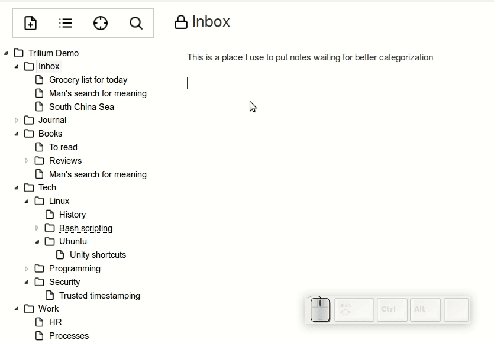

**外部链接**
--------

外部链接是针对某些外部网络资源的一般网络链接——例如[https://en.wikipedia.org/wiki/South_China_Sea](https://en.wikipedia.org/wiki/South_China_Sea)是指向一个维基百科页面的外部链接。

外部链接是通过 CKEditor 原生链接完成的。要创建外部链接，请选择文本并按下`CTRL-K`或等待“气泡”出现，然后单击那里的链接图标。

您可以通过双击（将打开新选项卡/窗口）或右键单击外部链接并选择“在新选项卡中打开”来跟踪外部链接。

**内部链接**
-----------

创建内部笔记的链接略有不同。要在当前光标位置创建笔记链接，请按`CTRL-L`。

在对话框中，您可以看到用于从不同类型的链接中进行选择的单选按钮：

*   链接标题反映了笔记的当前标题 - 这有时也称为“参考链接”。此类链接的标题无法更改，而是始终反映链接注释的标题。这样链接标题永远不会过时
*   链接标题可以任意更改 - 这是传统的超链接 - 您链接到特定的笔记，并且可以选择链接标题

您可以双击笔记链接。

或者，如果您只想快速预览内容，您可以将鼠标悬停在链接上并看到只读预览。

### **In-place链接**

Trilium 还提供“内联”链接 - 键入`@`，您会看到一个自动完成功能，只需从所需的笔记标题中键入几个字符，按 Enter 键，您就有一个链接。

**笔记映射图**
---------

Trilium 为特定笔记提供了传入和传出链接的可视化。有关详细信息，请参阅[笔记映射图](./笔记映射图.md)。